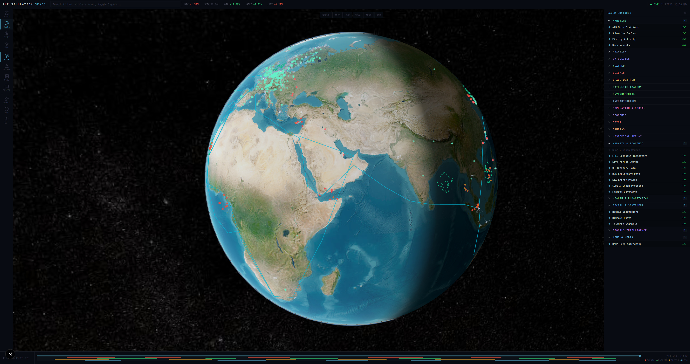
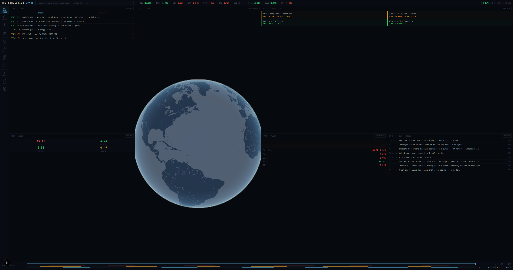
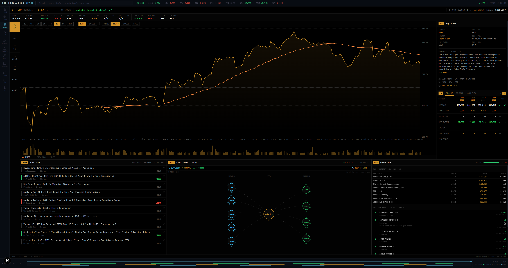
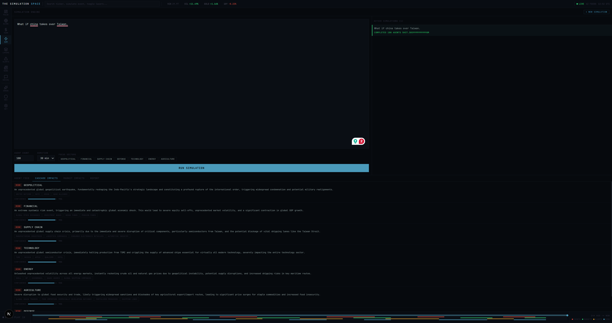

<p align="center">
  <h1 align="center">THE SIMULATION SPACE</h1>
  <p align="center">
    Real-time global intelligence and geopolitical simulation platform
  </p>
</p>

<p align="center">
  
  
  
  
  
  
</p>

---

## Overview

The Simulation Space is a browser-based geospatial intelligence platform that combines a 3D interactive globe with real-time data from 50+ sources, a multi-panel intelligence dashboard, an AI-powered research terminal, and a multi-agent simulation engine for geopolitical scenario modeling.

Built with a dual-canvas rendering architecture — CesiumJS handles the 3D globe and imagery while deck.gl overlays high-performance data visualization layers — the platform provides a unified workspace for monitoring global events, analyzing financial markets, and running what-if simulations with hundreds of AI agents.

---

## Screenshots

### Globe — 3D Geospatial Visualization
> Interactive CesiumJS globe with 56 toggleable data layers rendered via deck.gl overlay. Real-time feeds for flights, ships, earthquakes, satellites, and more.



### PULSE — Intelligence Dashboard
> Multi-panel dashboard showing live alerts, risk gauges, market data, recent simulations, and aggregated news from RSS, Reddit, and Bluesky.



### Terminal — AI Research Interface
> Bloomberg-style financial terminal with stock analysis, supply chain graph visualization, income/balance/cash flow data, and AI-powered research queries.



### Simulation — Multi-Agent Scenario Modeling
> Define geopolitical seed events, configure agent count and focus sectors, then run real multi-agent simulations powered by CAMEL-AI/OASIS with Zep knowledge graphs. Produces classified-style intelligence reports with cascading impact analysis and market predictions.



---

## Tech Stack

| Layer | Technology |
|-------|-----------|
| **Framework** | Next.js 15 (App Router) + React 19 |
| **Language** | TypeScript 5.7 |
| **3D Globe** | CesiumJS 1.139 + Resium |
| **Data Viz** | deck.gl 9.2 + Luma.gl + Loaders.gl |
| **State** | Zustand 5 + Immer |
| **Styling** | Tailwind CSS 4.0 |
| **Charts** | Recharts 3.8 |
| **Satellite Math** | satellite.js (SGP4 propagation) |
| **Simulation Engine** | Python 3.11 + CAMEL-AI + OASIS |
| **Knowledge Graphs** | Zep Cloud |
| **LLM** | Gemini (OpenAI-compatible endpoint) |
| **Testing** | Vitest + Testing Library |
| **Package Manager** | pnpm |

---

## Features

### Globe Module
- **56 data layers** across 20 categories (maritime, aviation, satellites, weather, seismic, environmental, infrastructure, economic, and more)
- Real-time streaming for AIS ships, commercial flights, earthquakes, and lightning
- Shader modes: CRT, Night Vision (NVG), FLIR thermal, Anime cel-shading, God mode
- 4D recording and playback system (IndexedDB-backed)
- Screen-space projection: CesiumJS handles all 3D math, deck.gl renders as pixel overlay
- Region filter bar with multiple imagery providers

### PULSE Dashboard
- Live event feed with priority-colored alerts
- Risk gauges: VIX volatility, geopolitical risk, supply chain pressure, energy risk
- Real-time market ticker (Yahoo Finance, FRED, Treasury, BLS, EIA)
- News aggregation from RSS feeds, Reddit, and Bluesky with sentiment analysis
- Recent simulation cards with quick access

### Terminal
- AI-powered research queries (Gemini-backed)
- Bloomberg-style stock analysis with chart, fundamentals, and supply chain mapping
- Income statement, balance sheet, and cash flow data
- Company profile, ownership, and insider transaction tracking
- Supply chain research agent (Nemotron-powered)

### Simulation Engine
- Multi-agent geopolitical scenario simulation
- CAMEL-AI/OASIS framework for agent behavior modeling
- Zep Cloud knowledge graphs for entity extraction and memory
- 10 specialized agent roles (Defense Analyst, Energy Trader, Supply Chain Manager, etc.)
- Real-time SSE streaming of simulation progress
- Classified-style intelligence reports with:
  - Executive summary and key findings
  - Cascading impact analysis across sectors
  - Market predictions with confidence intervals
  - Strategic recommendations
- Side-by-side simulation comparison

---

## Architecture

```
Browser
├── CesiumJS Canvas (3D globe, imagery, terrain)
├── deck.gl Canvas (transparent overlay, data layers)
│   └── Screen-space projection via Cesium.SceneTransforms
├── React UI (sidebar, panels, modules)
│   └── Zustand Store (13 slices)
│       ├── layer, camera, shader, timeline, ui
│       ├── market, alert, recording, simulation
│       └── selection, realtime, situation, tabs
└── SSE / WebSocket connections

Next.js API Routes
├── /api/proxy         → CORS proxy for blocked APIs
├── /api/simulate      → Spawns Python subprocess → SSE stream
├── /api/terminal/*    → AI research endpoints
├── /api/data/*        → FRED, BLS, EIA, Reddit, ReliefWeb
└── /api/ais, cameras, economic, population

Python Simulation Engine (subprocess)
├── run_simulation.py  → Entry point (stdin JSON → stdout SSE)
├── knowledge/         → Zep graph builder + entity reader
├── agents/            → Role definitions + profile generator
├── simulation/        → OASIS runner + LLM aggregator
└── report/            → Intelligence report synthesis
```

---

## Prerequisites

| Requirement | Version | Notes |
|------------|---------|-------|
| **Node.js** | 18+ | LTS recommended |
| **pnpm** | 9+ | `npm install -g pnpm` |
| **Python** | 3.11 | Required for simulation engine. 3.12+ has compatibility issues with camel-oasis |
| **Cesium Ion Token** | — | Free at [cesium.com/ion](https://cesium.com/ion) |
| **Gemini API Key** | — | [ai.google.dev](https://ai.google.dev) |

Optional API keys enhance specific features but are not required to run the platform.

---

## Quick Start

### 1. Clone and install

```bash
git clone https://github.com/your-username/the-simulation-space.git
cd the-simulation-space
pnpm install
```

### 2. Configure environment

```bash
cp .env.example .env.local
```

Edit `.env.local` and add your API keys (see [Environment Variables](#environment-variables) below).

At minimum, you need:
- `NEXT_PUBLIC_CESIUM_ION_TOKEN` — for the 3D globe
- `GEMINI_API_KEY` — for AI terminal and simulation engine

### 3. Set up Python simulation engine (optional)

```bash
cd src/simulation-engine
python -m venv .venv

# Windows
.venv\Scripts\activate

# macOS/Linux
source .venv/bin/activate

pip install -r requirements.txt
cd ../..
```

### 4. Run the development server

```bash
pnpm dev
```

Open [http://localhost:3000](http://localhost:3000) in your browser.

---

## Environment Variables

| Variable | Required | Description | Source |
|----------|----------|-------------|--------|
| `NEXT_PUBLIC_CESIUM_ION_TOKEN` | Yes | CesiumJS 3D globe rendering | [cesium.com/ion](https://cesium.com/ion) |
| `GEMINI_API_KEY` | Yes | AI terminal + simulation LLM | [ai.google.dev](https://ai.google.dev) |
| `ZEP_API_KEY` | For simulation | Knowledge graph memory | [getzep.com](https://www.getzep.com) |
| `FRED_API_KEY` | For markets | Federal Reserve economic data | [fred.stlouisfed.org](https://fred.stlouisfed.org/docs/api/api_key.html) |
| `EIA_API_KEY` | For energy | US Energy Information Administration | [eia.gov](https://www.eia.gov/opendata/register.php) |
| `AISSTREAM_API_KEY` | For ships | Live AIS vessel tracking | [aisstream.io](https://aisstream.io) |
| `WINDY_WEBCAM_API_KEY` | For cameras | Global webcam feeds | [api.windy.com](https://api.windy.com) |
| `NVIDIA_API_KEY` | For supply chain | Nemotron-powered research agent | [build.nvidia.com](https://build.nvidia.com) |
| `BRAVE_SEARCH_KEY` | Optional | Web search for terminal queries | [brave.com/search/api](https://brave.com/search/api) |
| `ACLED_API_KEY` | For conflicts | Armed conflict data | [acleddata.com](https://acleddata.com) |
| `RELIEFWEB_APPNAME` | For health | Humanitarian crisis data | Free, no registration |

---

## Project Structure

```
the-simulation-space/
├── src/
│   ├── app/
│   │   ├── page.tsx                 # Entry point
│   │   ├── layout.tsx               # Root layout + metadata
│   │   └── api/                     # 19 API routes
│   │       ├── proxy/               # CORS proxy
│   │       ├── simulate/            # Simulation SSE endpoint
│   │       ├── terminal/            # AI research endpoints
│   │       └── data/                # Market & intelligence data
│   ├── components/
│   │   ├── workspace/               # Shell, Sidebar, TopBar, StatusArea
│   │   ├── modules/
│   │   │   ├── globe/               # CesiumJS + deck.gl globe
│   │   │   ├── pulse/               # Intelligence dashboard
│   │   │   ├── terminal/            # AI research terminal
│   │   │   └── simulation/          # Multi-agent simulation
│   │   ├── panels/                  # Detail panels (market, news, events)
│   │   └── sidebar-panels/          # Layer controls, alerts, settings
│   ├── layers/                      # 56 data layer modules
│   │   ├── registry.ts              # Layer definitions
│   │   ├── maritime/                # AIS, submarine cables, fishing
│   │   ├── aviation/                # Commercial & military flights
│   │   ├── satellites/              # Active, ISS, debris
│   │   ├── weather/                 # Radar, wind, lightning
│   │   ├── seismic/                 # Earthquakes, plates, volcanoes
│   │   └── ...                      # 15 more categories
│   ├── store/                       # Zustand store (13 slices)
│   ├── hooks/                       # useLayerData, useDeckLayers, etc.
│   ├── shaders/                     # GLSL post-processing shaders
│   ├── lib/                         # Utilities, proxy-fetch, recording-db
│   └── types/                       # TypeScript type definitions
├── src/simulation-engine/           # Python multi-agent engine
│   ├── run_simulation.py            # Entry point
│   ├── requirements.txt             # Python dependencies
│   ├── agents/                      # Role definitions, profile generator
│   ├── knowledge/                   # Zep graph builder, entity reader
│   ├── simulation/                  # OASIS runner, aggregator
│   └── report/                      # Intelligence report generator
├── public/
│   ├── cesium/                      # CesiumJS static assets
│   └── geo/                         # Geospatial data files
├── docs/screenshots/                # Reference screenshots
├── next.config.ts                   # Webpack config (Cesium, GLSL, CORS)
├── tailwind.config.ts
└── package.json
```

---

## Data Layers

The platform includes **56 toggleable data layers** across 20 categories:

| Category | Layers | Data Sources |
|----------|--------|-------------|
| **Maritime** | AIS Ships, Submarine Cables, Fishing Activity, Dark Vessels | AISStream.io, TeleGeography, Global Fishing Watch |
| **Aviation** | Commercial Flights, Military Flights | ADSB.fi |
| **Satellites** | Active Satellites, ISS, Space Debris | CelesTrak TLE |
| **Weather** | Current Conditions, Radar (NEXRAD), Wind Flow, Lightning | Open-Meteo, Iowa Mesonet WMS, Blitzortung |
| **Seismic** | Earthquakes, Tectonic Plates, Volcanoes, Tsunamis | USGS, Smithsonian, NOAA |
| **Space Weather** | Aurora, Solar Wind, Near-Earth Objects | NOAA SWPC, NASA |
| **Imagery** | NASA GIBS, Sentinel-2, Nightlights | NASA, Copernicus |
| **Environmental** | Wildfires, Deforestation, Ocean Currents, Coral Reefs, Sea Ice | NASA FIRMS, Global Forest Watch |
| **Infrastructure** | Airports, Railways, Power Plants, Cell Towers | OpenStreetMap Overpass |
| **Population** | Density, News Events, Conflicts, Wikipedia POIs | WorldPop, GDELT, ACLED |
| **Economic** | Trade Flows, World Bank, Bitcoin Nodes, Supply Chains | World Bank, Bitnodes |
| **Markets** | FRED, Yahoo Finance, Treasury, BLS, EIA, GSCPI | Federal Reserve, Yahoo, Treasury.gov |
| **Health** | WHO Disease Alerts, ReliefWeb Humanitarian | WHO, ReliefWeb |
| **Social** | Reddit, Bluesky, Telegram | Reddit API, Bluesky AT Protocol |
| **Signals** | KiwiSDR, Strategic Patents | KiwiSDR, USPTO |
| **News** | RSS Feed Aggregator | Multiple RSS sources |
| **Cameras** | Webcams | Windy API |
| **Historical** | 4D Timeline Replay | IndexedDB recordings |
| **OSINT** | GPS Jamming, Sanctions, Border Wait Times, Radiation | GPSJam, OFAC, CBP |

---

## Scripts

| Command | Description |
|---------|-------------|
| `pnpm dev` | Start development server |
| `pnpm build` | Production build |
| `pnpm start` | Start production server |
| `pnpm lint` | Run ESLint |
| `pnpm type-check` | TypeScript type checking |
| `pnpm test` | Run tests (Vitest) |
| `pnpm test:watch` | Run tests in watch mode |

---

## CORS Proxy

Some external APIs block browser requests. The built-in CORS proxy at `/api/proxy` handles these automatically via the `proxyFetch()` utility. Currently proxied:

- ADSB.fi (aviation)
- Blitzortung (lightning)
- GDELT (news events)
- Smithsonian (volcanoes)

APIs with native CORS support (USGS, CelesTrak, Open-Meteo, NASA GIBS, etc.) are called directly from the browser.

---

## License

This project is licensed under the [GNU Affero General Public License v3.0](LICENSE) (AGPL-3.0).

You are free to use, modify, and distribute this software, provided that any modified versions — including those offered as a network service — also make their source code available under the same license.
